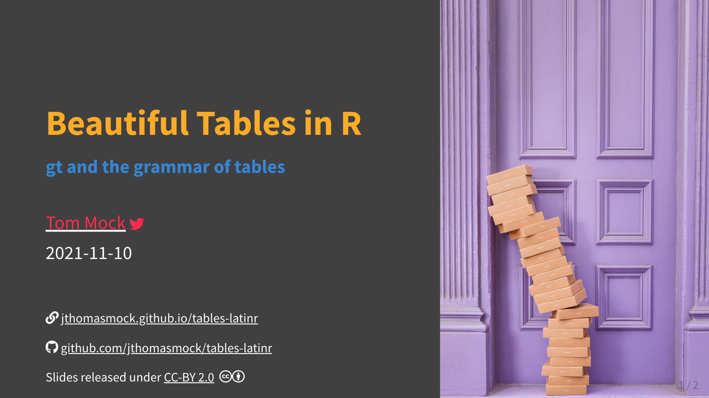

# Tables for the `latinr` conference

<!-- badges: start -->
<!-- badges: end -->

The goal of this presentation is to provide an overview of the [`gt` package](https://gt.rstudio.com/) along with the [`gtExtras` package](https://jthomasmock.github.io/gtExtras/) for creating beautiful tables quickly and easily.

[Xaringan Slides](https://jthomasmock.github.io/tables-latinr)

